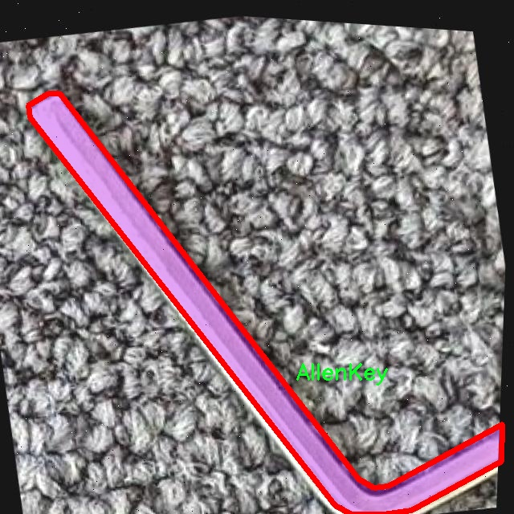

# 工具部件图像分割系统源码＆数据集分享
 [yolov8-seg-C2f-Parc＆yolov8-seg-C2f-DAttention等50+全套改进创新点发刊_一键训练教程_Web前端展示]

### 1.研究背景与意义

项目参考[ILSVRC ImageNet Large Scale Visual Recognition Challenge](https://gitee.com/YOLOv8_YOLOv11_Segmentation_Studio/projects)

项目来源[AAAI Global Al lnnovation Contest](https://kdocs.cn/l/cszuIiCKVNis)

研究背景与意义

随着工业自动化和智能制造的迅速发展，工具部件的高效识别与管理已成为现代生产过程中的一项重要任务。工具部件的精确分割与识别不仅能够提高生产效率，还能降低人工成本，减少错误率，进而提升整体生产质量。在这一背景下，计算机视觉技术的应用日益广泛，尤其是基于深度学习的图像分割技术，成为解决工具部件识别问题的重要手段。

YOLO（You Only Look Once）系列模型因其高效的实时目标检测能力而受到广泛关注。YOLOv8作为该系列的最新版本，进一步提升了模型的精度和速度，使其在复杂场景下的应用潜力更为巨大。然而，尽管YOLOv8在目标检测方面表现优异，但在工具部件的图像分割任务中，仍存在一定的局限性。特别是在处理具有相似形状和颜色的工具部件时，模型可能会出现识别混淆，导致分割效果不理想。因此，基于YOLOv8的改进研究显得尤为重要。

本研究旨在构建一个基于改进YOLOv8的工具部件图像分割系统，针对数据集中的16类工具部件进行精确分割。该数据集包含1400张图像，涵盖了包括AllenKey、Bearing2、Drill、Motor2等多种常见工具部件。通过对这些工具部件进行实例分割，不仅可以实现对每个部件的独立识别，还能够为后续的自动化管理提供数据支持。

在技术层面，研究将通过引入改进的网络结构和训练策略，提升YOLOv8在图像分割任务中的表现。具体而言，将结合多尺度特征融合、注意力机制等先进技术，增强模型对细节信息的捕捉能力，从而提高分割精度。此外，研究还将探索数据增强技术，以扩充训练数据集，提升模型的泛化能力和鲁棒性。

本研究的意义不仅在于技术层面的创新，更在于其对实际应用的推动作用。通过构建高效的工具部件图像分割系统，可以为工业生产中的工具管理、维护和监控提供有力支持，促进智能制造的发展。同时，该系统的成功实施将为其他领域的图像分割任务提供借鉴，推动计算机视觉技术在更广泛场景中的应用。

综上所述，基于改进YOLOv8的工具部件图像分割系统的研究，既是对现有技术的深化与拓展，也是对智能制造领域实际需求的积极响应。通过实现对工具部件的高效识别与管理，研究将为工业生产的智能化转型贡献力量，具有重要的理论价值和实际意义。

### 2.图片演示


##### 注意：由于此博客编辑较早，上面“2.图片演示”和“3.视频演示”展示的系统图片或者视频可能为老版本，新版本在老版本的基础上升级如下：（实际效果以升级的新版本为准）

  （1）适配了YOLOV8的“目标检测”模型和“实例分割”模型，通过加载相应的权重（.pt）文件即可自适应加载模型。

  （2）支持“图片识别”、“视频识别”、“摄像头实时识别”三种识别模式。

  （3）支持“图片识别”、“视频识别”、“摄像头实时识别”三种识别结果保存导出，解决手动导出（容易卡顿出现爆内存）存在的问题，识别完自动保存结果并导出到tempDir中。

  （4）支持Web前端系统中的标题、背景图等自定义修改，后面提供修改教程。

  另外本项目提供训练的数据集和训练教程,暂不提供权重文件（best.pt）,需要您按照教程进行训练后实现图片演示和Web前端界面演示的效果。

### 3.视频演示

[3.1 视频演示](https://www.bilibili.com/video/BV1w7mMYnEwE/)

### 4.数据集信息展示

##### 4.1 本项目数据集详细数据（类别数＆类别名）

nc: 15
names: ['AllenKey', 'Axis2', 'Bearing2', 'Drill', 'F20_20_B', 'F20_20_G', 'Housing', 'M20', 'M20_100', 'Motor2', 'S40_40_B', 'S40_40_G', 'Screwdriver', 'Spacer', 'Wrench']


##### 4.2 本项目数据集信息介绍

数据集信息展示

在现代计算机视觉领域，图像分割技术的应用日益广泛，尤其是在工业和制造业中，精确的工具部件识别与分割显得尤为重要。本研究所使用的数据集名为“Segmentation for boundingboxes”，旨在为改进YOLOv8-seg的工具部件图像分割系统提供高质量的训练数据。该数据集包含15个类别的工具部件，每个类别均具有独特的形状和特征，能够有效地支持深度学习模型在图像分割任务中的训练与评估。

具体而言，数据集中包含的类别包括：AllenKey、Axis2、Bearing2、Drill、F20_20_B、F20_20_G、Housing、M20、M20_100、Motor2、S40_40_B、S40_40_G、Screwdriver、Spacer和Wrench。这些类别涵盖了多种常见的工具部件，具有广泛的应用场景。AllenKey作为一种常用的内六角扳手，其特征在于其独特的L形设计，适合于紧固和松动螺钉。Axis2和Bearing2则代表了机械部件中常见的轴和轴承，具有较为复杂的几何形状，能够为模型提供挑战性的分割任务。

此外，数据集中还包括多种类型的电动工具和手动工具，如Drill（电钻）、Screwdriver（螺丝刀）和Wrench（扳手），这些工具在工业生产和日常生活中都扮演着重要角色。F20_20_B和F20_20_G、M20和M20_100等类别则代表了不同规格和型号的组件，体现了工具部件在功能和设计上的多样性。这种多样性不仅丰富了数据集的内容，也为模型的泛化能力提供了保障，使其能够在实际应用中更好地适应不同的工具类型。

数据集的构建过程经过精心设计，确保每个类别的样本数量均衡，且样本质量高。每个图像均经过标注，确保工具部件的边界清晰可见，从而为YOLOv8-seg模型的训练提供了准确的监督信号。数据集中的图像涵盖了不同的拍摄角度、光照条件和背景环境，旨在模拟真实世界中的各种情况。这种多样化的训练数据能够帮助模型学习到更为鲁棒的特征，从而在实际应用中实现更高的分割精度。

在训练过程中，YOLOv8-seg模型将利用该数据集进行特征提取和学习，逐步优化其分割算法。通过不断迭代和调整，模型将能够实现对工具部件的高效识别与分割，为后续的自动化操作和智能制造提供支持。最终，期望通过这一数据集的应用，推动工具部件图像分割技术的发展，提升工业生产的自动化水平和效率。

综上所述，“Segmentation for boundingboxes”数据集不仅为YOLOv8-seg模型的训练提供了丰富的样本和类别支持，还为工具部件的精确识别与分割奠定了坚实的基础。随着技术的不断进步，期待该数据集能够在未来的研究和应用中发挥更大的作用。




### 5.全套项目环境部署视频教程（零基础手把手教学）

[5.1 环境部署教程链接（零基础手把手教学）](https://www.bilibili.com/video/BV1jG4Ve4E9t/?vd_source=bc9aec86d164b67a7004b996143742dc)


[5.2 安装Python虚拟环境创建和依赖库安装视频教程链接（零基础手把手教学）](https://www.bilibili.com/video/BV1nA4VeYEze/?vd_source=bc9aec86d164b67a7004b996143742dc)

### 6.手把手YOLOV8-seg训练视频教程（零基础小白有手就能学会）

[6.1 手把手YOLOV8-seg训练视频教程（零基础小白有手就能学会）](https://www.bilibili.com/video/BV1cA4VeYETe/?vd_source=bc9aec86d164b67a7004b996143742dc)


按照上面的训练视频教程链接加载项目提供的数据集，运行train.py即可开始训练



     Epoch   gpu_mem       box       obj       cls    labels  img_size
     1/200     0G   0.01576   0.01955  0.007536        22      1280: 100%|██████████| 849/849 [14:42<00:00,  1.04s/it]
               Class     Images     Labels          P          R     mAP@.5 mAP@.5:.95: 100%|██████████| 213/213 [01:14<00:00,  2.87it/s]
                 all       3395      17314      0.994      0.957      0.0957      0.0843

     Epoch   gpu_mem       box       obj       cls    labels  img_size
     2/200     0G   0.01578   0.01923  0.007006        22      1280: 100%|██████████| 849/849 [14:44<00:00,  1.04s/it]
               Class     Images     Labels          P          R     mAP@.5 mAP@.5:.95: 100%|██████████| 213/213 [01:12<00:00,  2.95it/s]
                 all       3395      17314      0.996      0.956      0.0957      0.0845

     Epoch   gpu_mem       box       obj       cls    labels  img_size
     3/200     0G   0.01561    0.0191  0.006895        27      1280: 100%|██████████| 849/849 [10:56<00:00,  1.29it/s]
               Class     Images     Labels          P          R     mAP@.5 mAP@.5:.95: 100%|███████   | 187/213 [00:52<00:00,  4.04it/s]
                 all       3395      17314      0.996      0.957      0.0957      0.0845


### 7.50+种全套YOLOV8-seg创新点代码加载调参视频教程（一键加载写好的改进模型的配置文件）

[7.1 50+种全套YOLOV8-seg创新点代码加载调参视频教程（一键加载写好的改进模型的配置文件）](https://www.bilibili.com/video/BV1Hw4VePEXv/?vd_source=bc9aec86d164b67a7004b996143742dc)

### 8.YOLOV8-seg图像分割算法原理

原始YOLOV8-seg算法原理

YOLOv8-seg算法是YOLO系列的最新版本，结合了目标检测与语义分割的能力，旨在提升在复杂场景下的目标识别与分割精度。该算法在YOLOv5的基础上进行了多项创新和改进，使其在检测精度和速度上均有显著提升。YOLOv8的设计思路是通过高效的网络结构和先进的训练策略，实现对不同场景和目标的灵活适应。

YOLOv8网络结构主要分为四个部分：输入端、骨干网络、颈部网络和头部网络。输入端负责对输入图像进行预处理，包括马赛克数据增强、自适应锚框计算和自适应灰度填充等。这些预处理步骤不仅增强了数据的多样性，还提高了模型对不同光照和背景条件的鲁棒性。通过这些方法，YOLOv8能够在各种复杂环境中保持良好的性能。

在骨干网络部分，YOLOv8采用了C2f和SPPF（Spatial Pyramid Pooling Fusion）结构。C2f模块是对残差特征进行学习的主要模块，其设计灵感来源于YOLOv7的ELAN结构。C2f模块通过引入更多的分支和跨层连接，显著增强了模型的梯度流，使得特征表示能力得到了极大的提升。这种结构的优势在于能够更好地捕捉图像中的细节信息，尤其是在处理小目标时表现尤为突出。SPPF结构则通过空间金字塔池化技术，进一步增强了模型对不同尺度目标的适应能力，使得YOLOv8在处理多尺度目标时能够保持高效的特征提取能力。

颈部网络采用了路径聚合网络（PAN）结构，这一设计使得不同缩放尺度的特征能够更好地融合。PAN通过上采样和下采样的方式，将来自不同层次的特征图进行拼接，确保了网络在进行目标检测时能够充分利用多层次的信息。这种特征融合策略不仅提升了模型的检测精度，还增强了对复杂背景的适应能力，使得YOLOv8在多种应用场景中表现出色。

头部网络是YOLOv8的关键部分，其主要任务是解耦分类和检测过程。与以往的耦合头设计不同，YOLOv8采用了主流的解耦头结构，这种结构使得分类和回归任务可以独立进行，从而提高了模型的训练效率和预测精度。在损失计算方面，YOLOv8引入了Task-Aligned Assigner策略，通过对分类与回归分数的加权，选择合适的正样本进行训练。分类分支使用二元交叉熵损失（BCELoss），而回归分支则结合了分布焦点损失（DFLoss）和完全交并比损失（CIOULoss），进一步提升了模型对边界框预测的精准性。

YOLOv8-seg算法的创新之处在于其引入了语义分割的能力，使得模型不仅能够识别目标，还能够对目标进行精确的分割。这一特性在处理复杂场景时尤为重要，例如在水面环境中，漂浮物的特征复杂且背景多样，传统的目标检测算法往往难以应对。而YOLOv8-seg通过结合目标检测与语义分割的优势，能够有效地识别并分割出这些小目标，从而提高了模型的整体性能。

此外，YOLOv8在模型轻量化方面也做出了重要的改进。通过优化网络结构，减少参数量，YOLOv8n版本成为了参数量最小且检测速度最快的模型。这一设计不仅保证了算法的实时性，还使得模型在边缘设备上的应用成为可能。YOLOv8的轻量化特性使得其在移动设备和嵌入式系统中得到了广泛应用，极大地拓展了其应用场景。

尽管YOLOv8-seg在多方面表现出色，但在复杂水面环境下仍然存在一些挑战。例如，小目标的漂浮物特征复杂，背景多样，可能导致定位误差和对目标感知能力不足。为了解决这些问题，研究者们提出了YOLOv8-WSSOD算法，通过引入BiFormer双层路由注意力机制，构建C2fBF模块，以保留特征提取过程中更细粒度的上下文信息。同时，针对小目标漏检问题，添加了更小的检测头，以提升网络对小目标的感知力。此外，在Neck端引入GSConv和Slim-neck技术，进一步保持了精度并降低了计算量，最终使用MPDIoU损失函数替换CIoU损失函数，提高了模型的泛化能力和精准度。

综上所述，YOLOv8-seg算法通过一系列创新的设计和改进，成功地将目标检测与语义分割结合在一起，提升了在复杂场景下的目标识别与分割能力。其高效的网络结构、先进的训练策略以及轻量化设计，使得YOLOv8-seg在多个应用领域中展现出广阔的前景。随着技术的不断进步，YOLOv8-seg无疑将在未来的计算机视觉任务中发挥越来越重要的作用。


### 9.系统功能展示（检测对象为举例，实际内容以本项目数据集为准）

图9.1.系统支持检测结果表格显示

  图9.2.系统支持置信度和IOU阈值手动调节

  图9.3.系统支持自定义加载权重文件best.pt(需要你通过步骤5中训练获得)

  图9.4.系统支持摄像头实时识别

  图9.5.系统支持图片识别

  图9.6.系统支持视频识别

  图9.7.系统支持识别结果文件自动保存

  图9.8.系统支持Excel导出检测结果数据


### 10.50+种全套YOLOV8-seg创新点原理讲解（非科班也可以轻松写刊发刊，V11版本正在科研待更新）

#### 10.1 由于篇幅限制，每个创新点的具体原理讲解就不一一展开，具体见下列网址中的创新点对应子项目的技术原理博客网址【Blog】：


[10.1 50+种全套YOLOV8-seg创新点原理讲解链接](https://gitee.com/qunmasj/good)

#### 10.2 部分改进模块原理讲解(完整的改进原理见上图和技术博客链接)【如果此小节的图加载失败可以通过CSDN或者Github搜索该博客的标题访问原始博客，原始博客图片显示正常】
### YOLOv8简介
#### Backbone


借鉴了其他算法的这些设计思想

借鉴了VGG的思想，使用了较多的3×3卷积，在每一次池化操作后，将通道数翻倍；

借鉴了network in network的思想，使用全局平均池化（global average pooling）做预测，并把1×1的卷积核置于3×3的卷积核之间，用来压缩特征；（我没找到这一步体现在哪里）

使用了批归一化层稳定模型训练，加速收敛，并且起到正则化作用。

    以上三点为Darknet19借鉴其他模型的点。Darknet53当然是在继承了Darknet19的这些优点的基础上再新增了下面这些优点的。因此列在了这里

借鉴了ResNet的思想，在网络中大量使用了残差连接，因此网络结构可以设计的很深，并且缓解了训练中梯度消失的问题，使得模型更容易收敛。

使用步长为2的卷积层代替池化层实现降采样。（这一点在经典的Darknet-53上是很明显的，output的长和宽从256降到128，再降低到64，一路降低到8，应该是通过步长为2的卷积层实现的；在YOLOv8的卷积层中也有体现，比如图中我标出的这些位置）

#### 特征融合

模型架构图如下

  Darknet-53的特点可以这样概括：（Conv卷积模块+Residual Block残差块）串行叠加4次

  Conv卷积层+Residual Block残差网络就被称为一个stage


上面红色指出的那个，原始的Darknet-53里面有一层 卷积，在YOLOv8里面，把一层卷积移除了

为什么移除呢？

        原始Darknet-53模型中间加的这个卷积层做了什么？滤波器（卷积核）的个数从 上一个卷积层的512个，先增加到1024个卷积核，然后下一层卷积的卷积核的个数又降低到512个

        移除掉这一层以后，少了1024个卷积核，就可以少做1024次卷积运算，同时也少了1024个3×3的卷积核的参数，也就是少了9×1024个参数需要拟合。这样可以大大减少了模型的参数，（相当于做了轻量化吧）

        移除掉这个卷积层，可能是因为作者发现移除掉这个卷积层以后，模型的score有所提升，所以才移除掉的。为什么移除掉以后，分数有所提高呢？可能是因为多了这些参数就容易，参数过多导致模型在训练集删过拟合，但是在测试集上表现很差，最终模型的分数比较低。你移除掉这个卷积层以后，参数减少了，过拟合现象不那么严重了，泛化能力增强了。当然这个是，拿着你做实验的结论，反过来再找补，再去强行解释这种现象的合理性。

过拟合


通过MMdetection官方绘制册这个图我们可以看到，进来的这张图片经过一个“Feature Pyramid Network(简称FPN)”，然后最后的P3、P4、P5传递给下一层的Neck和Head去做识别任务。 PAN（Path Aggregation Network）


“FPN是自顶向下，将高层的强语义特征传递下来。PAN就是在FPN的后面添加一个自底向上的金字塔，对FPN补充，将低层的强定位特征传递上去，

FPN是自顶（小尺寸，卷积次数多得到的结果，语义信息丰富）向下（大尺寸，卷积次数少得到的结果），将高层的强语义特征传递下来，对整个金字塔进行增强，不过只增强了语义信息，对定位信息没有传递。PAN就是针对这一点，在FPN的后面添加一个自底（卷积次数少，大尺寸）向上（卷积次数多，小尺寸，语义信息丰富）的金字塔，对FPN补充，将低层的强定位特征传递上去，又被称之为“双塔战术”。

FPN层自顶向下传达强语义特征，而特征金字塔则自底向上传达强定位特征，两两联手，从不同的主干层对不同的检测层进行参数聚合,这样的操作确实很皮。
#### 自底向上增强

而 PAN（Path Aggregation Network）是对 FPN 的一种改进，它的设计理念是在 FPN 后面添加一个自底向上的金字塔。PAN 引入了路径聚合的方式，通过将浅层特征图（低分辨率但语义信息较弱）和深层特征图（高分辨率但语义信息丰富）进行聚合，并沿着特定的路径传递特征信息，将低层的强定位特征传递上去。这样的操作能够进一步增强多尺度特征的表达能力，使得 PAN 在目标检测任务中表现更加优秀。


### 可重参化EfficientRepBiPAN优化Neck
#### Repvgg-style
Repvgg-style的卷积层包含
卷积+ReLU结构，该结构能够有效地利用硬件资源。

在训练时，Repvgg-style的卷积层包含
卷积、
卷积、identity。（下图左图）


在推理时，通过重参数化（re-parameterization），上述的多分支结构可以转换为单分支的
卷积。（下图右图）


基于上述思想，作者设计了对GPU硬件友好的EfficientRep Backbone和Rep-PAN Neck，将它们用于YOLOv6中。

EfficientRep Backbone的结构图：


Rep-PAN Neck结构图：


#### Multi-path
只使用repvgg-style不能达到很好的精度-速度平衡，对于大模型，作者探索了多路径的网络结构。

参考该博客提出了Bep unit，其结构如下图所示：


CSP（Cross Stage Partial）-style计算量小，且有丰富的梯度融合信息，广泛应用于YOLO系列中，比如YOLOv5、PPYOLOE。

作者将Bep unit与CSP-style结合，设计了一种新的网络结构BepC3，如下图所示：


基于BepC3模块，作者设计了新的CSPBep Backbone和CSPRepPAN Neck，以达到很好的精度-速度平衡。

其他YOLO系列在使用CSP-stype结构时，partial ratio设置为1/2。为了达到更好的性能，在YOLOv6m中partial ratio的值为2/3，在YOLOv6l中partial ratio的值为1/2。

对于YOLOv6m，单纯使用Rep-style结构和使用BepC3结构的对比如下图所示：

#### BIFPN
BiFPN 全称 Bidirectional Feature Pyramid Network 加权双向（自顶向下 + 自低向上）特征金字塔网络。

相比较于PANet，BiFPN在设计上的改变：

总结下图：
图d 蓝色部分为自顶向下的通路，传递的是高层特征的语义信息；红色部分是自底向上的通路，传递的是低层特征的位置信息；紫色部分是上述第二点提到的同一层在输入节点和输入节点间新加的一条边。


我们删除那些只有一条输入边的节点。这么做的思路很简单：如果一个节点只有一条输入边而没有特征融合，那么它对旨在融合不同特征的特征网络的贡献就会很小。删除它对我们的网络影响不大，同时简化了双向网络；如上图d 的 P7右边第一个节点

如果原始输入节点和输出节点处于同一层，我们会在原始输入节点和输出节点之间添加一条额外的边。思路：以在不增加太多成本的情况下融合更多的特性；

与只有一个自顶向下和一个自底向上路径的PANet不同，我们处理每个双向路径(自顶向下和自底而上)路径作为一个特征网络层，并重复同一层多次，以实现更高层次的特征融合。如下图EfficientNet 的网络结构所示，我们对BiFPN是重复使用多次的。而这个使用次数也不是我们认为设定的，而是作为参数一起加入网络的设计当中，使用NAS技术算出来的。


Weighted Feature Fusion 带权特征融合：学习不同输入特征的重要性，对不同输入特征有区分的融合。
设计思路：传统的特征融合往往只是简单的 feature map 叠加/相加 (sum them up)，比如使用concat或者shortcut连接，而不对同时加进来的 feature map 进行区分。然而，不同的输入 feature map 具有不同的分辨率，它们对融合输入 feature map 的贡献也是不同的，因此简单的对他们进行相加或叠加处理并不是最佳的操作。所以这里我们提出了一种简单而高效的加权特融合的机制。
常见的带权特征融合有三种方法，分别是：


​
  这种方法比较简单，直接加一个可学习的权重。但是由于这个权重不受限制，所有可能引起训练的不稳定，所有并不推荐。
Softmax-based fusion: O = ∑ i e w i ∗ I i ϵ + ∑ j e w j O = \sum_{i} \frac{e^{w_i} * I_i}{ \epsilon+\sum_{j}e^{w_j}}O=∑ 

 

​
  使用这种方法可以将范围放缩到 [ 0 , 1 ] [0, 1][0,1] 之间，训练稳定，但是训练很慢，所有也不推荐。
Fast normalized fusion: O = ∑ i w i ∗ I i ϵ + ∑ j w j O = \sum_{i} \frac{w_i * I_i}{ \epsilon+\sum_{j}w_j}O=∑ 


### 11.项目核心源码讲解（再也不用担心看不懂代码逻辑）

#### 11.1 ultralytics\models\sam\modules\encoders.py

以下是对代码中最核心部分的提炼和详细注释：

```python
import torch
import torch.nn as nn
from typing import Optional, Tuple, Type

class ImageEncoderViT(nn.Module):
    """
    使用视觉变换器（ViT）架构的图像编码器，将图像编码为紧凑的潜在空间。
    """

    def __init__(self, img_size: int = 1024, patch_size: int = 16, in_chans: int = 3, embed_dim: int = 768, depth: int = 12,
                 num_heads: int = 12, mlp_ratio: float = 4.0, out_chans: int = 256) -> None:
        """
        初始化图像编码器的参数。

        Args:
            img_size (int): 输入图像的大小（假设为正方形）。
            patch_size (int): 每个补丁的大小。
            in_chans (int): 输入图像的通道数。
            embed_dim (int): 补丁嵌入的维度。
            depth (int): ViT的深度（变换器块的数量）。
            num_heads (int): 每个ViT块中的注意力头数量。
            mlp_ratio (float): MLP隐藏层维度与嵌入维度的比率。
            out_chans (int): 输出通道数。
        """
        super().__init__()
        self.img_size = img_size

        # 补丁嵌入层，将图像分割为补丁并进行嵌入
        self.patch_embed = PatchEmbed(kernel_size=(patch_size, patch_size), stride=(patch_size, patch_size),
                                      in_chans=in_chans, embed_dim=embed_dim)

        # Transformer块的列表
        self.blocks = nn.ModuleList([Block(embed_dim, num_heads, mlp_ratio) for _ in range(depth)])

        # 颈部模块，用于进一步处理输出
        self.neck = nn.Sequential(
            nn.Conv2d(embed_dim, out_chans, kernel_size=1, bias=False),
            nn.LayerNorm(out_chans),
            nn.Conv2d(out_chans, out_chans, kernel_size=3, padding=1, bias=False),
            nn.LayerNorm(out_chans),
        )

    def forward(self, x: torch.Tensor) -> torch.Tensor:
        """
        前向传播：处理输入图像，通过补丁嵌入、Transformer块和颈部模块。

        Args:
            x (torch.Tensor): 输入图像张量。

        Returns:
            torch.Tensor: 编码后的输出张量。
        """
        x = self.patch_embed(x)  # 将图像分割为补丁并嵌入
        for blk in self.blocks:  # 通过每个Transformer块
            x = blk(x)
        return self.neck(x.permute(0, 3, 1, 2))  # 调整维度并通过颈部模块


class PatchEmbed(nn.Module):
    """图像到补丁嵌入的转换。"""

    def __init__(self, kernel_size: Tuple[int, int] = (16, 16), stride: Tuple[int, int] = (16, 16),
                 in_chans: int = 3, embed_dim: int = 768) -> None:
        """
        初始化补丁嵌入模块。

        Args:
            kernel_size (Tuple): 卷积核的大小。
            stride (Tuple): 卷积的步幅。
            in_chans (int): 输入图像的通道数。
            embed_dim (int): 补丁嵌入的维度。
        """
        super().__init__()
        self.proj = nn.Conv2d(in_chans, embed_dim, kernel_size=kernel_size, stride=stride)

    def forward(self, x: torch.Tensor) -> torch.Tensor:
        """计算补丁嵌入，通过卷积并调整结果张量的维度。"""
        return self.proj(x).permute(0, 2, 3, 1)  # B C H W -> B H W C


class Block(nn.Module):
    """Transformer块，支持窗口注意力和残差传播。"""

    def __init__(self, dim: int, num_heads: int, mlp_ratio: float = 4.0) -> None:
        """
        初始化Transformer块。

        Args:
            dim (int): 输入通道数。
            num_heads (int): 注意力头的数量。
            mlp_ratio (float): MLP隐藏层维度与嵌入维度的比率。
        """
        super().__init__()
        self.norm1 = nn.LayerNorm(dim)  # 归一化层
        self.attn = Attention(dim, num_heads)  # 注意力层
        self.norm2 = nn.LayerNorm(dim)  # 归一化层
        self.mlp = MLPBlock(dim, int(dim * mlp_ratio))  # MLP块

    def forward(self, x: torch.Tensor) -> torch.Tensor:
        """执行Transformer块的前向传播。"""
        shortcut = x
        x = self.norm1(x)  # 归一化
        x = self.attn(x)  # 注意力计算
        x = shortcut + x  # 残差连接
        return x + self.mlp(self.norm2(x))  # 通过MLP块并返回


class Attention(nn.Module):
    """多头注意力块，支持相对位置嵌入。"""

    def __init__(self, dim: int, num_heads: int = 8) -> None:
        """
        初始化注意力模块。

        Args:
            dim (int): 输入通道数。
            num_heads (int): 注意力头的数量。
        """
        super().__init__()
        self.num_heads = num_heads
        self.qkv = nn.Linear(dim, dim * 3)  # 查询、键、值的线性变换
        self.proj = nn.Linear(dim, dim)  # 输出的线性变换

    def forward(self, x: torch.Tensor) -> torch.Tensor:
        """应用前向操作，包括注意力计算和输出投影。"""
        B, H, W, _ = x.shape
        qkv = self.qkv(x).reshape(B, H * W, 3, self.num_heads, -1).permute(2, 0, 3, 1, 4)  # 计算qkv
        q, k, v = qkv.unbind(0)  # 分离q、k、v
        attn = (q @ k.transpose(-2, -1)) * (1.0 / (q.size(-1) ** 0.5))  # 计算注意力
        attn = attn.softmax(dim=-1)  # softmax归一化
        x = (attn @ v).view(B, H, W, -1)  # 应用注意力
        return self.proj(x)  # 投影输出
```

### 代码说明：
1. **ImageEncoderViT**: 这是一个图像编码器，使用ViT架构将输入图像编码为潜在空间。它将图像分割为补丁，应用位置嵌入，并通过多个Transformer块进行处理。
  
2. **PatchEmbed**: 该模块负责将输入图像转换为补丁嵌入，使用卷积操作来实现。

3. **Block**: 这是一个Transformer块，包含注意力机制和MLP层，支持残差连接和层归一化。

4. **Attention**: 这是多头注意力机制的实现，计算查询、键、值之间的关系并输出结果。

这些部分是实现ViT的核心，其他辅助功能和细节可以根据需要进行扩展和修改。

这个文件包含了用于图像编码和提示编码的多个类，主要实现了基于视觉变换器（ViT）架构的图像编码器和用于处理不同类型提示的编码器。

首先，`ImageEncoderViT`类是一个图像编码器，使用ViT架构将输入图像编码为紧凑的潜在空间。该编码器首先将图像分割成多个小块（patches），然后通过一系列的变换块（transformer blocks）处理这些小块。编码后的小块经过一个“neck”模块进一步处理，生成最终的编码表示。构造函数中定义了输入图像的大小、补丁大小、输入通道数、嵌入维度、变换块的深度、注意力头的数量等参数。该类的`forward`方法实现了对输入图像的处理，包括补丁嵌入、位置嵌入（如果存在的话）、通过变换块的处理，以及最后通过neck模块的输出。

接下来是`PromptEncoder`类，它用于编码不同类型的提示，包括点、框和掩码，以便输入到SAM的掩码解码器。该编码器生成稀疏和密集的嵌入。构造函数中定义了嵌入维度、输入图像大小、图像嵌入大小、掩码输入通道数以及激活函数等参数。`forward`方法则根据输入的点、框和掩码生成相应的嵌入，返回稀疏和密集的嵌入表示。

`PositionEmbeddingRandom`类用于生成基于随机空间频率的位置信息编码。它的构造函数初始化了一个随机的高斯矩阵，并在`forward`方法中生成指定大小的网格的位置信息编码。

`Block`类实现了变换器块，支持窗口注意力和残差传播。它包含了标准的归一化层、注意力机制和多层感知机（MLP）模块。`Attention`类则实现了多头注意力机制，支持相对位置嵌入。

`PatchEmbed`类用于将图像转换为补丁嵌入，通过卷积操作实现。它的`forward`方法通过卷积计算补丁嵌入，并调整输出张量的维度。

整体来看，这个文件实现了一个复杂的图像编码框架，结合了现代深度学习中的多种技术，如变换器架构、注意力机制和位置编码，适用于图像处理和计算机视觉任务。

#### 11.2 ui.py

以下是经过简化和注释的核心代码部分：

```python
import sys
import subprocess

def run_script(script_path):
    """
    使用当前 Python 环境运行指定的脚本。

    Args:
        script_path (str): 要运行的脚本路径

    Returns:
        None
    """
    # 获取当前 Python 解释器的路径
    python_path = sys.executable

    # 构建运行命令，使用 streamlit 运行指定的脚本
    command = f'"{python_path}" -m streamlit run "{script_path}"'

    # 执行命令并等待其完成
    result = subprocess.run(command, shell=True)
    
    # 检查命令执行结果，如果返回码不为0，则表示出错
    if result.returncode != 0:
        print("脚本运行出错。")

# 主程序入口
if __name__ == "__main__":
    # 指定要运行的脚本路径
    script_path = "web.py"  # 这里可以直接指定脚本路径

    # 调用函数运行脚本
    run_script(script_path)
```

### 代码注释说明：
1. **导入模块**：
   - `sys`：用于获取当前 Python 解释器的路径。
   - `subprocess`：用于执行外部命令。

2. **`run_script` 函数**：
   - 接受一个参数 `script_path`，表示要运行的 Python 脚本的路径。
   - 使用 `sys.executable` 获取当前 Python 解释器的路径。
   - 构建一个命令字符串，使用 `streamlit` 模块运行指定的脚本。
   - 使用 `subprocess.run` 执行命令，并等待其完成。
   - 检查命令的返回码，如果不为0，表示脚本运行出错，打印错误信息。

3. **主程序入口**：
   - 当脚本作为主程序运行时，指定要运行的脚本路径（这里直接指定为 `"web.py"`）。
   - 调用 `run_script` 函数执行指定的脚本。

这个程序文件的主要功能是通过当前的 Python 环境来运行一个指定的脚本，具体来说是一个名为 `web.py` 的脚本。程序首先导入了必要的模块，包括 `sys`、`os` 和 `subprocess`，这些模块分别用于获取系统信息、处理文件路径和执行外部命令。

在 `run_script` 函数中，首先获取当前 Python 解释器的路径，这样可以确保使用的是正确的 Python 环境。接着，构建一个命令字符串，这个命令使用 `streamlit` 来运行指定的脚本。`streamlit` 是一个用于构建数据应用的框架，因此这里的脚本 `web.py` 很可能是一个与数据可视化或交互式应用相关的脚本。

然后，使用 `subprocess.run` 方法来执行构建好的命令。这个方法会在新的 shell 中运行命令，并等待其完成。如果命令执行的返回码不为零，表示脚本运行出错，程序会打印出相应的错误信息。

在文件的最后部分，使用 `if __name__ == "__main__":` 来确保当这个文件作为主程序运行时，会执行以下代码。这里指定了要运行的脚本路径 `web.py`，并调用 `run_script` 函数来执行它。

总的来说，这个程序的目的是为了方便地在当前 Python 环境中运行一个 Streamlit 应用脚本，并处理可能出现的错误。

#### 11.3 ultralytics\nn\extra_modules\attention.py

以下是保留的核心代码部分，并附上详细的中文注释：

```python
import torch
from torch import nn
import torch.nn.functional as F

class EMA(nn.Module):
    def __init__(self, channels, factor=8):
        super(EMA, self).__init__()
        self.groups = factor  # 分组数
        assert channels // self.groups > 0  # 确保每组至少有一个通道
        self.softmax = nn.Softmax(-1)  # Softmax层
        self.agp = nn.AdaptiveAvgPool2d((1, 1))  # 自适应平均池化
        self.pool_h = nn.AdaptiveAvgPool2d((None, 1))  # 对高度进行池化
        self.pool_w = nn.AdaptiveAvgPool2d((1, None))  # 对宽度进行池化
        self.gn = nn.GroupNorm(channels // self.groups, channels // self.groups)  # 分组归一化
        self.conv1x1 = nn.Conv2d(channels // self.groups, channels // self.groups, kernel_size=1)  # 1x1卷积
        self.conv3x3 = nn.Conv2d(channels // self.groups, channels // self.groups, kernel_size=3, padding=1)  # 3x3卷积

    def forward(self, x):
        b, c, h, w = x.size()  # 获取输入的尺寸
        group_x = x.reshape(b * self.groups, -1, h, w)  # 将输入重塑为分组形式
        x_h = self.pool_h(group_x)  # 对高度进行池化
        x_w = self.pool_w(group_x).permute(0, 1, 3, 2)  # 对宽度进行池化并转置
        hw = self.conv1x1(torch.cat([x_h, x_w], dim=2))  # 1x1卷积
        x_h, x_w = torch.split(hw, [h, w], dim=2)  # 将结果分为高度和宽度部分
        x1 = self.gn(group_x * x_h.sigmoid() * x_w.permute(0, 1, 3, 2).sigmoid())  # 应用分组归一化
        x2 = self.conv3x3(group_x)  # 3x3卷积
        x11 = self.softmax(self.agp(x1).reshape(b * self.groups, -1, 1).permute(0, 2, 1))  # 对x1进行softmax
        x12 = x2.reshape(b * self.groups, c // self.groups, -1)  # 重塑x2
        x21 = self.softmax(self.agp(x2).reshape(b * self.groups, -1, 1).permute(0, 2, 1))  # 对x2进行softmax
        x22 = x1.reshape(b * self.groups, c // self.groups, -1)  # 重塑x1
        weights = (torch.matmul(x11, x12) + torch.matmul(x21, x22)).reshape(b * self.groups, 1, h, w)  # 计算权重
        return (group_x * weights.sigmoid()).reshape(b, c, h, w)  # 返回加权后的结果

class SimAM(nn.Module):
    def __init__(self, e_lambda=1e-4):
        super(SimAM, self).__init__()
        self.activaton = nn.Sigmoid()  # Sigmoid激活函数
        self.e_lambda = e_lambda  # 正则化参数

    def forward(self, x):
        b, c, h, w = x.size()  # 获取输入的尺寸
        n = w * h - 1  # 计算区域大小
        x_minus_mu_square = (x - x.mean(dim=[2, 3], keepdim=True)).pow(2)  # 计算方差
        y = x_minus_mu_square / (4 * (x_minus_mu_square.sum(dim=[2, 3], keepdim=True) / n + self.e_lambda)) + 0.5  # 计算y
        return x * self.activaton(y)  # 返回加权后的结果

class SpatialGroupEnhance(nn.Module):
    def __init__(self, groups=8):
        super().__init__()
        self.groups = groups  # 分组数
        self.avg_pool = nn.AdaptiveAvgPool2d(1)  # 自适应平均池化
        self.weight = nn.Parameter(torch.zeros(1, groups, 1, 1))  # 权重参数
        self.bias = nn.Parameter(torch.zeros(1, groups, 1, 1))  # 偏置参数
        self.sig = nn.Sigmoid()  # Sigmoid激活函数
        self.init_weights()  # 初始化权重

    def init_weights(self):
        for m in self.modules():
            if isinstance(m, nn.Conv2d):
                nn.init.kaiming_normal_(m.weight, mode='fan_out')  # Kaiming初始化
                if m.bias is not None:
                    nn.init.constant_(m.bias, 0)  # 偏置初始化为0

    def forward(self, x):
        b, c, h, w = x.shape  # 获取输入的尺寸
        x = x.view(b * self.groups, -1, h, w)  # 重塑输入
        xn = x * self.avg_pool(x)  # 计算加权
        xn = xn.sum(dim=1, keepdim=True)  # 对每组求和
        t = xn.view(b * self.groups, -1)  # 重塑
        t = t - t.mean(dim=1, keepdim=True)  # 去均值
        std = t.std(dim=1, keepdim=True) + 1e-5  # 计算标准差
        t = t / std  # 标准化
        t = t.view(b, self.groups, h, w)  # 重塑
        t = t * self.weight + self.bias  # 加权
        t = t.view(b * self.groups, 1, h, w)  # 重塑
        x = x * self.sig(t)  # 应用Sigmoid激活
        x = x.view(b, c, h, w)  # 返回原始形状
        return x
```

### 代码说明
1. **EMA类**：实现了一个增强的移动平均（Exponential Moving Average）模块，通过对输入进行分组处理，计算加权后的输出。
2. **SimAM类**：实现了一个简单的自适应模块（SimAM），通过计算输入的方差并应用Sigmoid激活函数来调整输入。
3. **SpatialGroupEnhance类**：实现了空间分组增强，通过自适应平均池化和Sigmoid激活函数来增强输入特征。 

这些模块在计算机视觉任务中可以用于特征增强和自适应处理，提升模型的性能。

这个程序文件`ultralytics/nn/extra_modules/attention.py`主要实现了一些用于深度学习模型的注意力机制模块，特别是在计算机视觉任务中。以下是对文件中各个部分的详细讲解。

首先，文件导入了一些必要的库，包括`torch`和`torchvision`，以及一些用于高效计算的模块，比如`MemoryEfficientSwish`和`einops`。这些库提供了深度学习所需的基础功能和高效的张量操作。

文件中定义了多个类，每个类实现了一种特定的注意力机制或模块。以下是主要类的概述：

1. **EMA (Exponential Moving Average)**：该类实现了一种基于通道的注意力机制，通过对输入特征图进行分组处理，计算每个组的平均值，并利用这些平均值来调整输入特征图的通道权重。

2. **SimAM (Similarity Attention Module)**：这是一个简单的注意力模块，通过计算输入特征图的均值和方差来生成注意力权重，并使用Sigmoid激活函数来调整输入特征图。

3. **SpatialGroupEnhance**：该模块通过对输入特征图进行空间分组增强，利用自适应平均池化和卷积操作来生成空间注意力权重。

4. **TopkRouting**：实现了一种可微分的Top-k路由机制，用于选择最重要的特征进行后续处理。

5. **KVGather**：该模块用于根据路由索引选择键值对（key-value pairs），并根据指定的权重进行加权。

6. **QKVLinear**：这是一个简单的线性层，用于生成查询（Q）、键（K）和值（V）向量。

7. **BiLevelRoutingAttention**：实现了一种双层路由注意力机制，结合了局部和全局的注意力计算，通过对输入特征图进行窗口划分来计算注意力。

8. **CoordAtt**：该模块实现了坐标注意力机制，通过对输入特征图的水平和垂直方向进行处理，生成空间注意力权重。

9. **BAMBlock**：实现了通道注意力和空间注意力的结合，增强了特征图的表达能力。

10. **EfficientAttention**：这是一个高效的注意力模块，结合了多种卷积操作和注意力机制，以提高计算效率。

11. **LSKA (Large-Separable-Kernel-Attention)**：实现了一种大可分离卷积的注意力机制，通过多个卷积层提取特征。

12. **SegNext_Attention**：这是一个针对分割任务的注意力模块，结合了多种卷积操作来增强特征图。

13. **FocusedLinearAttention**：实现了一种聚焦线性注意力机制，通过将输入特征图划分为多个窗口来计算注意力。

每个类的`forward`方法定义了如何处理输入数据并生成输出特征图，通常包括对输入进行线性变换、卷积操作、注意力计算等步骤。通过这些模块的组合，可以构建出具有复杂注意力机制的深度学习模型，适用于各种计算机视觉任务，如图像分类、目标检测和语义分割等。

总的来说，这个文件提供了一系列高效且灵活的注意力机制实现，能够在深度学习模型中提升特征表示能力和计算效率。

#### 11.4 ultralytics\nn\modules\transformer.py

以下是代码中最核心的部分，并附上详细的中文注释：

```python
import torch
import torch.nn as nn
import torch.nn.functional as F

class TransformerEncoderLayer(nn.Module):
    """定义一个Transformer编码器层。"""

    def __init__(self, c1, cm=2048, num_heads=8, dropout=0.0, act=nn.GELU(), normalize_before=False):
        """初始化TransformerEncoderLayer，设置参数。"""
        super().__init__()
        self.ma = nn.MultiheadAttention(c1, num_heads, dropout=dropout, batch_first=True)  # 多头自注意力机制
        self.fc1 = nn.Linear(c1, cm)  # 前馈网络的第一层
        self.fc2 = nn.Linear(cm, c1)  # 前馈网络的第二层
        self.norm1 = nn.LayerNorm(c1)  # 第一层归一化
        self.norm2 = nn.LayerNorm(c1)  # 第二层归一化
        self.dropout = nn.Dropout(dropout)  # dropout层
        self.dropout1 = nn.Dropout(dropout)  # 第一个dropout层
        self.dropout2 = nn.Dropout(dropout)  # 第二个dropout层
        self.act = act  # 激活函数
        self.normalize_before = normalize_before  # 是否在前向传播前进行归一化

    def forward(self, src, src_mask=None, src_key_padding_mask=None, pos=None):
        """通过编码器模块进行前向传播。"""
        if self.normalize_before:
            return self.forward_pre(src, src_mask, src_key_padding_mask, pos)  # 前归一化
        return self.forward_post(src, src_mask, src_key_padding_mask, pos)  # 后归一化

    def forward_post(self, src, src_mask=None, src_key_padding_mask=None, pos=None):
        """后归一化的前向传播。"""
        q = k = self.with_pos_embed(src, pos)  # 计算查询和键
        src2 = self.ma(q, k, value=src, attn_mask=src_mask, key_padding_mask=src_key_padding_mask)[0]  # 自注意力计算
        src = src + self.dropout1(src2)  # 残差连接
        src = self.norm1(src)  # 归一化
        src2 = self.fc2(self.dropout(self.act(self.fc1(src))))  # 前馈网络
        src = src + self.dropout2(src2)  # 残差连接
        return self.norm2(src)  # 归一化

    @staticmethod
    def with_pos_embed(tensor, pos=None):
        """如果提供了位置嵌入，则将其添加到张量中。"""
        return tensor if pos is None else tensor + pos

class MSDeformAttn(nn.Module):
    """多尺度可变形注意力模块。"""

    def __init__(self, d_model=256, n_levels=4, n_heads=8, n_points=4):
        """初始化多尺度可变形注意力模块。"""
        super().__init__()
        self.d_model = d_model  # 模型维度
        self.n_levels = n_levels  # 级别数量
        self.n_heads = n_heads  # 注意力头数量
        self.n_points = n_points  # 每个级别的点数量

        # 定义线性层用于采样偏移和注意力权重
        self.sampling_offsets = nn.Linear(d_model, n_heads * n_levels * n_points * 2)
        self.attention_weights = nn.Linear(d_model, n_heads * n_levels * n_points)
        self.value_proj = nn.Linear(d_model, d_model)  # 值的投影
        self.output_proj = nn.Linear(d_model, d_model)  # 输出的投影

    def forward(self, query, refer_bbox, value, value_shapes, value_mask=None):
        """执行多尺度可变形注意力的前向传播。"""
        bs, len_q = query.shape[:2]  # 批量大小和查询长度
        len_v = value.shape[1]  # 值的长度

        value = self.value_proj(value)  # 投影值
        if value_mask is not None:
            value = value.masked_fill(value_mask[..., None], float(0))  # 应用掩码
        value = value.view(bs, len_v, self.n_heads, self.d_model // self.n_heads)  # 重塑值的形状

        # 计算采样偏移和注意力权重
        sampling_offsets = self.sampling_offsets(query).view(bs, len_q, self.n_heads, self.n_levels, self.n_points, 2)
        attention_weights = self.attention_weights(query).view(bs, len_q, self.n_heads, self.n_levels * self.n_points)
        attention_weights = F.softmax(attention_weights, -1).view(bs, len_q, self.n_heads, self.n_levels, self.n_points)

        # 计算采样位置
        add = sampling_offsets / self.n_points * refer_bbox[:, :, None, :, None, 2:] * 0.5
        sampling_locations = refer_bbox[:, :, None, :, None, :2] + add

        # 使用多尺度可变形注意力进行计算
        output = multi_scale_deformable_attn_pytorch(value, value_shapes, sampling_locations, attention_weights)
        return self.output_proj(output)  # 输出投影
```

### 代码核心部分解释：
1. **TransformerEncoderLayer**：实现了Transformer编码器的单层，包含多头自注意力机制和前馈网络。支持前归一化和后归一化两种模式。
2. **MSDeformAttn**：实现了多尺度可变形注意力机制，能够处理不同尺度的特征图，并根据参考边界框计算采样位置和注意力权重。 

这些部分是实现Transformer架构的关键，适用于图像处理和其他序列数据的任务。

这个程序文件是一个实现Transformer模块的Python代码，主要用于计算机视觉任务中的模型架构，特别是与YOLO（You Only Look Once）相关的任务。代码中定义了多个类，主要包括TransformerEncoderLayer、AIFI、TransformerLayer、TransformerBlock、MLPBlock、MLP、LayerNorm2d、MSDeformAttn、DeformableTransformerDecoderLayer和DeformableTransformerDecoder等。

首先，TransformerEncoderLayer类定义了Transformer编码器的单层结构。它的构造函数接受多个参数，包括输入通道数、隐藏层通道数、头数、dropout比率、激活函数和是否在前面进行归一化等。该类实现了前向传播的方法，包括后归一化和前归一化两种方式。通过多头自注意力机制和前馈神经网络，处理输入数据并返回结果。

AIFI类继承自TransformerEncoderLayer，主要用于实现具有2D位置嵌入的Transformer层。它的前向传播方法中会构建2D正弦余弦位置嵌入，并将输入数据进行展平和变换，以适应Transformer的输入格式。

TransformerLayer类实现了一个基本的Transformer层，使用线性变换和多头注意力机制。它的前向传播方法将输入数据通过自注意力机制和前馈网络进行处理，并返回结果。

TransformerBlock类则实现了一个视觉Transformer模块，包含多个Transformer层和可选的卷积层。它将输入数据进行处理并返回经过多层Transformer处理后的结果。

MLPBlock和MLP类实现了多层感知机（MLP）的结构，前者定义了一个单独的MLP块，后者则实现了一个完整的MLP，支持多层结构。

LayerNorm2d类实现了2D层归一化，用于对输入数据进行归一化处理，以提高模型的训练稳定性和性能。

MSDeformAttn类实现了多尺度可变形注意力机制，主要用于处理不同尺度的特征图，增强模型对不同形状和尺寸目标的适应能力。

DeformableTransformerDecoderLayer和DeformableTransformerDecoder类实现了可变形Transformer解码器的结构。解码器层通过自注意力和交叉注意力机制处理输入特征，并通过前馈网络进行进一步处理。解码器类则负责将多个解码器层组合在一起，进行逐层处理并输出最终的结果。

整体来看，这个文件实现了一个复杂的Transformer架构，结合了自注意力机制、前馈网络和可变形注意力机制，适用于视觉任务中的特征提取和目标检测等应用。代码中还包含了一些参数初始化和位置嵌入的构建方法，以增强模型的表现。

#### 11.5 ultralytics\nn\extra_modules\ops_dcnv3\modules\__init__.py

以下是代码中最核心的部分，并附上详细的中文注释：

```python
# 导入所需的模块
from .dcnv3 import DCNv3, DCNv3_pytorch, DCNv3_DyHead

# 这里的代码从当前包（.）中导入了三个类或函数：
# 1. DCNv3：可能是一个深度可分离卷积网络的实现。
# 2. DCNv3_pytorch：可能是针对PyTorch框架的DCNv3实现。
# 3. DCNv3_DyHead：可能是与动态头部（Dynamic Head）相关的实现，用于目标检测或分割任务。

# 这些导入的组件可能在后续的代码中被用来构建神经网络模型或进行相关的计算。
```

以上是代码的核心部分及其详细注释，主要说明了导入的模块及其可能的用途。

这个程序文件是一个Python模块的初始化文件，位于`ultralytics/nn/extra_modules/ops_dcnv3/modules/`目录下。文件的开头包含了一些版权信息，表明该代码属于OpenGVLab，并且使用MIT许可证，这意味着用户可以自由使用、修改和分发该代码，只要遵循许可证的条款。

在文件的主体部分，使用了`from`语句导入了三个类或函数：`DCNv3`、`DCNv3_pytorch`和`DCNv3_DyHead`。这些导入语句表明，这个模块主要是为了提供与DCNv3相关的功能或实现。

`DCNv3`可能是一个实现了某种深度学习操作的类，通常与卷积神经网络（CNN）相关。`DCNv3_pytorch`可能是该操作在PyTorch框架下的实现，而`DCNv3_DyHead`可能是与动态头部（Dynamic Head）相关的实现。这些功能通常用于计算机视觉任务，如目标检测或图像分割。

总的来说，这个初始化文件的作用是将特定的功能模块导入到当前包中，以便其他模块或脚本可以方便地使用这些功能。

#### 11.6 ultralytics\utils\callbacks\tensorboard.py

以下是代码中最核心的部分，并附上详细的中文注释：

```python
# 导入必要的库
from ultralytics.utils import LOGGER, SETTINGS, TESTS_RUNNING, colorstr

try:
    # 尝试导入TensorBoard的SummaryWriter，用于记录训练过程中的数据
    from torch.utils.tensorboard import SummaryWriter

    # 确保当前不是在测试运行中
    assert not TESTS_RUNNING  
    # 确保TensorBoard集成已启用
    assert SETTINGS['tensorboard'] is True  
    WRITER = None  # 初始化TensorBoard的SummaryWriter实例

except (ImportError, AssertionError, TypeError):
    # 处理导入错误或断言错误，确保在Windows上处理protobuf错误
    SummaryWriter = None


def _log_scalars(scalars, step=0):
    """将标量值记录到TensorBoard中。"""
    if WRITER:  # 如果WRITER已初始化
        for k, v in scalars.items():  # 遍历标量字典
            WRITER.add_scalar(k, v, step)  # 记录每个标量值


def _log_tensorboard_graph(trainer):
    """将模型图记录到TensorBoard中。"""
    try:
        import warnings
        from ultralytics.utils.torch_utils import de_parallel, torch

        imgsz = trainer.args.imgsz  # 获取输入图像大小
        imgsz = (imgsz, imgsz) if isinstance(imgsz, int) else imgsz  # 确保图像大小为元组
        p = next(trainer.model.parameters())  # 获取模型参数以确定设备和类型
        im = torch.zeros((1, 3, *imgsz), device=p.device, dtype=p.dtype)  # 创建一个输入图像（必须是零，不是空的）
        
        with warnings.catch_warnings():
            warnings.simplefilter('ignore', category=UserWarning)  # 忽略JIT跟踪警告
            WRITER.add_graph(torch.jit.trace(de_parallel(trainer.model), im, strict=False), [])  # 记录模型图
    except Exception as e:
        LOGGER.warning(f'WARNING ⚠️ TensorBoard图形可视化失败 {e}')  # 记录警告信息


def on_pretrain_routine_start(trainer):
    """使用SummaryWriter初始化TensorBoard日志记录。"""
    if SummaryWriter:  # 如果SummaryWriter可用
        try:
            global WRITER
            WRITER = SummaryWriter(str(trainer.save_dir))  # 初始化SummaryWriter，指定日志保存目录
            prefix = colorstr('TensorBoard: ')
            LOGGER.info(f"{prefix}使用 'tensorboard --logdir {trainer.save_dir}' 启动，查看地址为 http://localhost:6006/")  # 输出TensorBoard启动信息
        except Exception as e:
            LOGGER.warning(f'WARNING ⚠️ TensorBoard未正确初始化，未记录此次运行。 {e}')  # 记录警告信息


def on_train_start(trainer):
    """记录TensorBoard图形。"""
    if WRITER:  # 如果WRITER已初始化
        _log_tensorboard_graph(trainer)  # 记录模型图


def on_batch_end(trainer):
    """在训练批次结束时记录标量统计信息。"""
    _log_scalars(trainer.label_loss_items(trainer.tloss, prefix='train'), trainer.epoch + 1)  # 记录训练损失


def on_fit_epoch_end(trainer):
    """在训练周期结束时记录周期指标。"""
    _log_scalars(trainer.metrics, trainer.epoch + 1)  # 记录训练周期的指标


# 定义回调函数字典，只有在SummaryWriter可用时才会初始化
callbacks = {
    'on_pretrain_routine_start': on_pretrain_routine_start,
    'on_train_start': on_train_start,
    'on_fit_epoch_end': on_fit_epoch_end,
    'on_batch_end': on_batch_end} if SummaryWriter else {}
```

### 代码核心部分说明：
1. **导入和初始化**：导入必要的库并尝试初始化TensorBoard的`SummaryWriter`，用于记录训练过程中的各种指标。
2. **日志记录函数**：定义了几个函数用于记录标量值和模型图，包括在训练开始、每个批次结束和每个周期结束时的记录。
3. **回调机制**：使用字典存储回调函数，便于在训练过程中调用，确保只有在`SummaryWriter`可用时才会执行相关操作。

这个程序文件是一个用于集成 TensorBoard 日志记录的回调模块，主要用于 Ultralytics YOLO 项目。它的功能是将训练过程中的一些重要信息记录到 TensorBoard，以便于可视化和分析模型的训练情况。

文件开始部分导入了一些必要的模块和库，包括日志记录器 LOGGER、设置 SETTINGS 和测试状态 TESTS_RUNNING。接着，尝试从 PyTorch 的 utils 中导入 SummaryWriter 类，这是 TensorBoard 的核心组件。为了避免在运行测试时记录日志，代码中添加了相关的断言，确保在测试运行时不会执行日志记录。同时，还检查了 SETTINGS 中的 TensorBoard 集成是否启用。如果导入或断言失败，则将 SummaryWriter 设置为 None，以防止后续代码出错。

接下来的几个函数负责具体的日志记录操作。`_log_scalars` 函数用于将标量值记录到 TensorBoard，接收一个字典类型的标量和步数作为参数。如果 WRITER 实例存在，则遍历标量字典并调用 `add_scalar` 方法记录每个标量。

`_log_tensorboard_graph` 函数用于将模型的计算图记录到 TensorBoard。它首先导入必要的模块，并准备输入图像的张量。然后，使用 `torch.jit.trace` 方法对模型进行跟踪，并将生成的图添加到 TensorBoard。如果在过程中发生异常，则会记录警告信息。

`on_pretrain_routine_start` 函数在训练前的例程开始时被调用，用于初始化 TensorBoard 的日志记录。它创建一个 SummaryWriter 实例，并输出相关信息，指导用户如何启动 TensorBoard 进行查看。

`on_train_start` 函数在训练开始时被调用，负责记录模型的计算图。

`on_batch_end` 函数在每个训练批次结束时被调用，记录当前批次的标量统计信息。

`on_fit_epoch_end` 函数在每个训练周期结束时被调用，记录该周期的指标。

最后，程序定义了一个回调字典 `callbacks`，将各个回调函数与其对应的事件关联起来。如果 SummaryWriter 不可用，则该字典为空，确保在没有 TensorBoard 支持的情况下不会执行任何日志记录操作。整体上，这个模块通过回调机制实现了对训练过程的监控和可视化，帮助用户更好地理解和分析模型的训练情况。

### 12.系统整体结构（节选）

### 整体功能和架构概括

Ultralytics项目是一个用于计算机视觉任务的深度学习框架，特别是目标检测和图像分割。它结合了现代深度学习技术，如Transformer和卷积神经网络（CNN），并提供了高效的模型训练和推理功能。该项目的架构模块化，便于扩展和维护。每个模块和文件都负责特定的功能，从模型定义、训练过程到日志记录和可视化，形成一个完整的工作流。

以下是各个文件的功能整理表：

| 文件路径                                           | 功能描述                                                                                     |
|---------------------------------------------------|----------------------------------------------------------------------------------------------|
| `ultralytics/models/sam/modules/encoders.py`     | 实现图像编码器和提示编码器，主要用于基于视觉变换器（ViT）的图像处理。                       |
| `ui.py`                                           | 通过当前Python环境运行指定的Streamlit脚本，便于可视化和交互式应用。                       |
| `ultralytics/nn/extra_modules/attention.py`      | 实现多种注意力机制模块，增强深度学习模型的特征表示能力，适用于计算机视觉任务。             |
| `ultralytics/nn/modules/transformer.py`          | 实现Transformer架构，包括编码器和解码器层，结合自注意力机制用于特征提取。                 |
| `ultralytics/nn/extra_modules/ops_dcnv3/modules/__init__.py` | 初始化文件，导入与DCNv3相关的功能模块，提供深度学习操作的实现。                          |
| `ultralytics/utils/callbacks/tensorboard.py`     | 集成TensorBoard日志记录功能，监控训练过程并可视化模型性能。                               |
| `train.py`                                       | 训练模型的主程序，负责加载数据、初始化模型、执行训练和验证过程。                          |
| `ultralytics/models/utils/loss.py`               | 定义损失函数，用于模型训练过程中的损失计算和优化。                                         |
| `ultralytics/solutions/ai_gym.py`                | 提供与AI Gym集成的功能，可能用于强化学习或模拟环境的交互。                                 |
| `ultralytics/nn/__init__.py`                     | 初始化文件，组织和导入神经网络模块，便于模块的整体管理。                                   |
| `ultralytics/models/rtdetr/__init__.py`          | 初始化文件，可能用于RT-DETR模型的相关功能模块的组织和导入。                               |
| `ultralytics/models/sam/amg.py`                  | 实现与SAM（Segment Anything Model）相关的功能，可能包括图像分割和处理的实现。              |
| `ultralytics/models/yolo/detect/predict.py`      | 实现YOLO模型的推理功能，负责目标检测的具体实现，包括加载模型和处理输入图像。             |

以上表格总结了每个文件的主要功能，展示了Ultralytics项目的模块化设计和各个组件之间的协作关系。通过这些模块，用户可以方便地进行模型训练、推理和结果可视化。

注意：由于此博客编辑较早，上面“11.项目核心源码讲解（再也不用担心看不懂代码逻辑）”中部分代码可能会优化升级，仅供参考学习，完整“训练源码”、“Web前端界面”和“50+种创新点源码”以“14.完整训练+Web前端界面+50+种创新点源码、数据集获取”的内容为准。

### 13.图片、视频、摄像头图像分割Demo(去除WebUI)代码

在这个博客小节中，我们将讨论如何在不使用WebUI的情况下，实现图像分割模型的使用。本项目代码已经优化整合，方便用户将分割功能嵌入自己的项目中。
核心功能包括图片、视频、摄像头图像的分割，ROI区域的轮廓提取、类别分类、周长计算、面积计算、圆度计算以及颜色提取等。
这些功能提供了良好的二次开发基础。

### 核心代码解读

以下是主要代码片段，我们会为每一块代码进行详细的批注解释：

```python
import random
import cv2
import numpy as np
from PIL import ImageFont, ImageDraw, Image
from hashlib import md5
from model import Web_Detector
from chinese_name_list import Label_list

# 根据名称生成颜色
def generate_color_based_on_name(name):
    ......

# 计算多边形面积
def calculate_polygon_area(points):
    return cv2.contourArea(points.astype(np.float32))

...
# 绘制中文标签
def draw_with_chinese(image, text, position, font_size=20, color=(255, 0, 0)):
    image_pil = Image.fromarray(cv2.cvtColor(image, cv2.COLOR_BGR2RGB))
    draw = ImageDraw.Draw(image_pil)
    font = ImageFont.truetype("simsun.ttc", font_size, encoding="unic")
    draw.text(position, text, font=font, fill=color)
    return cv2.cvtColor(np.array(image_pil), cv2.COLOR_RGB2BGR)

# 动态调整参数
def adjust_parameter(image_size, base_size=1000):
    max_size = max(image_size)
    return max_size / base_size

# 绘制检测结果
def draw_detections(image, info, alpha=0.2):
    name, bbox, conf, cls_id, mask = info['class_name'], info['bbox'], info['score'], info['class_id'], info['mask']
    adjust_param = adjust_parameter(image.shape[:2])
    spacing = int(20 * adjust_param)

    if mask is None:
        x1, y1, x2, y2 = bbox
        aim_frame_area = (x2 - x1) * (y2 - y1)
        cv2.rectangle(image, (x1, y1), (x2, y2), color=(0, 0, 255), thickness=int(3 * adjust_param))
        image = draw_with_chinese(image, name, (x1, y1 - int(30 * adjust_param)), font_size=int(35 * adjust_param))
        y_offset = int(50 * adjust_param)  # 类别名称上方绘制，其下方留出空间
    else:
        mask_points = np.concatenate(mask)
        aim_frame_area = calculate_polygon_area(mask_points)
        mask_color = generate_color_based_on_name(name)
        try:
            overlay = image.copy()
            cv2.fillPoly(overlay, [mask_points.astype(np.int32)], mask_color)
            image = cv2.addWeighted(overlay, 0.3, image, 0.7, 0)
            cv2.drawContours(image, [mask_points.astype(np.int32)], -1, (0, 0, 255), thickness=int(8 * adjust_param))

            # 计算面积、周长、圆度
            area = cv2.contourArea(mask_points.astype(np.int32))
            perimeter = cv2.arcLength(mask_points.astype(np.int32), True)
            ......

            # 计算色彩
            mask = np.zeros(image.shape[:2], dtype=np.uint8)
            cv2.drawContours(mask, [mask_points.astype(np.int32)], -1, 255, -1)
            color_points = cv2.findNonZero(mask)
            ......

            # 绘制类别名称
            x, y = np.min(mask_points, axis=0).astype(int)
            image = draw_with_chinese(image, name, (x, y - int(30 * adjust_param)), font_size=int(35 * adjust_param))
            y_offset = int(50 * adjust_param)

            # 绘制面积、周长、圆度和色彩值
            metrics = [("Area", area), ("Perimeter", perimeter), ("Circularity", circularity), ("Color", color_str)]
            for idx, (metric_name, metric_value) in enumerate(metrics):
                ......

    return image, aim_frame_area

# 处理每帧图像
def process_frame(model, image):
    pre_img = model.preprocess(image)
    pred = model.predict(pre_img)
    det = pred[0] if det is not None and len(det)
    if det:
        det_info = model.postprocess(pred)
        for info in det_info:
            image, _ = draw_detections(image, info)
    return image

if __name__ == "__main__":
    cls_name = Label_list
    model = Web_Detector()
    model.load_model("./weights/yolov8s-seg.pt")

    # 摄像头实时处理
    cap = cv2.VideoCapture(0)
    while cap.isOpened():
        ret, frame = cap.read()
        if not ret:
            break
        ......

    # 图片处理
    image_path = './icon/OIP.jpg'
    image = cv2.imread(image_path)
    if image is not None:
        processed_image = process_frame(model, image)
        ......

    # 视频处理
    video_path = ''  # 输入视频的路径
    cap = cv2.VideoCapture(video_path)
    while cap.isOpened():
        ret, frame = cap.read()
        ......
```


### 14.完整训练+Web前端界面+50+种创新点源码、数据集获取


# [下载链接：https://mbd.pub/o/bread/Zp2Yk5xw](https://mbd.pub/o/bread/Zp2Yk5xw)